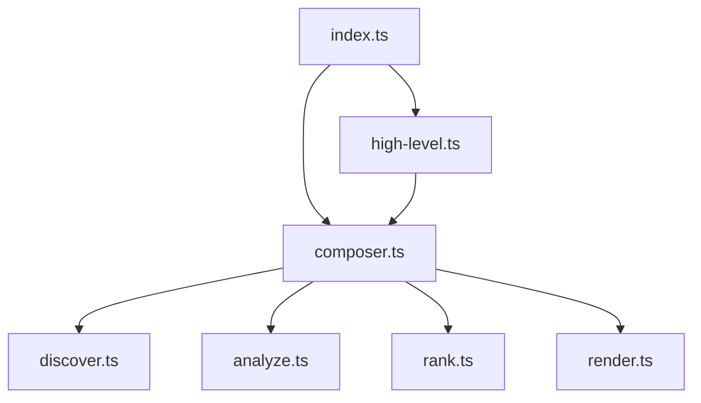

# Directory Structure
```
repograph/
  src/
    index.ts
  README.md
src/
  cli.ts
  index.ts
  serializer.ts
package.json
tsconfig.json
tsup.config.ts
```

# Files

## File: repograph/src/index.ts
````typescript
#!/usr/bin/env bun

import { logger } from './utils/logger.util';
import { RepoGraphError } from './utils/error.util';
// High-Level API for simple use cases
import { generateMap as executeGenerateMap } from './high-level';
import { type RepoGraphOptions as IRepoGraphOptions } from './types';

export { analyzeProject, generateMap } from './high-level';
export { initializeParser } from './tree-sitter/languages';

// Low-Level API for composition and advanced use cases
export { createMapGenerator } from './composer';

// Default pipeline component factories
export { createDefaultDiscoverer } from './pipeline/discover';
export { createTreeSitterAnalyzer } from './pipeline/analyze';
export { createPageRanker, createGitRanker } from './pipeline/rank';
export { createMarkdownRenderer } from './pipeline/render';

// Logger utilities
export { logger } from './utils/logger.util';
export type { LogLevel, Logger } from './utils/logger.util';
export type { ParserInitializationOptions } from './tree-sitter/languages';

// Core types for building custom components
export type {
  Analyzer,
  FileContent,
  CodeNode,
  CodeNodeType,
  CodeNodeVisibility,
  CodeEdge,
  CodeGraph,
  RankedCodeGraph,
  RepoGraphMap,
  RepoGraphOptions,
  CssIntent,
  Ranker,
  Renderer,
  RendererOptions,
  FileDiscoverer,
} from './types';

// This section runs only when the script is executed directly from the CLI
import { fileURLToPath } from 'node:url';
import path from 'node:path';

const isRunningDirectly = () => {
  if (typeof process.argv[1] === 'undefined') return false;
  const runningFile = path.resolve(process.argv[1]);
  const currentFile = fileURLToPath(import.meta.url);
  return runningFile === currentFile;
};

const copyWasmFiles = async (destination: string) => {
  const isBrowser = typeof window !== 'undefined' && typeof window.document !== 'undefined';
  if (isBrowser) {
    logger.error('File system operations are not available in the browser.');
    return;
  }

  try {
    const { promises: fs } = await import('node:fs');
    const path = await import('node:path');

    // Source is relative to the running script (dist/index.js)
    const sourceDir = path.resolve(fileURLToPath(import.meta.url), '..', 'wasm');
    
    await fs.mkdir(destination, { recursive: true });

    const wasmFiles = (await fs.readdir(sourceDir)).filter(file => file.endsWith('.wasm'));
    for (const file of wasmFiles) {
      const srcPath = path.join(sourceDir, file);
      const destPath = path.join(destination, file);
      await fs.copyFile(srcPath, destPath);
      logger.info(`Copied ${file} to ${path.relative(process.cwd(), destPath)}`);
    }
    logger.info(`\n✅ All ${wasmFiles.length} WASM files copied successfully.`);
  } catch (err) {
    logger.error('Error copying WASM files.', err);
  }
};

if (isRunningDirectly()) {
  (async () => {
    const args = process.argv.slice(2);

    if (args.includes('--help') || args.includes('-h')) {
      console.log(`
Usage: repograph [root] [options]
       repograph copy-wasm [destination]

Commands:
  [root]                   Analyze a repository at the given root path. This is the default command.
  copy-wasm [destination]  Copy the necessary Tree-sitter WASM files to a specified directory
                           for browser-based usage.
                           (default destination: "./public/wasm")

Arguments:
  root                     The root directory of the repository to analyze. Defaults to the current working directory.

Options:
  -h, --help               Display this help message.
  -v, --version            Display the version number.
  --output <path>          Path to the output Markdown file. (default: "repograph.md")
  --include <pattern>      Glob pattern for files to include. Can be specified multiple times.
  --ignore <pattern>       Glob pattern for files to ignore. Can be specified multiple times.
  --no-gitignore           Do not respect .gitignore files.
  --ranking-strategy <name> The ranking strategy to use. (default: "pagerank", options: "pagerank", "git-changes")
  --max-workers <num>      Set the maximum number of parallel workers for analysis. (default: 1)
  --log-level <level>      Set the logging level. (default: "info", options: "silent", "error", "warn", "info", "debug")

Output Formatting:
  --no-header              Do not include the main "RepoGraph" header.
  --no-overview            Do not include the project overview section.
  --no-mermaid             Do not include the Mermaid dependency graph.
  --no-file-list           Do not include the list of top-ranked files.
  --no-symbol-details      Do not include the detailed file and symbol breakdown.
  --top-file-count <num>   Set the number of files in the top list. (default: 10)
  --file-section-separator <str> Custom separator for file sections. (default: "---")
  --no-symbol-relations    Hide symbol relationship details (e.g., calls, implements).
  --no-symbol-line-numbers Hide line numbers for symbols.
  --no-symbol-snippets     Hide code snippets for symbols.
  --max-relations-to-show <num> Max number of 'calls' relations to show per symbol. (default: 3)
    `);
      process.exit(0);
    }

    if (args[0] === 'copy-wasm') {
      const destDir = args[1] || './public/wasm';
      logger.info(`Copying WASM files to "${path.resolve(destDir)}"...`);
      await copyWasmFiles(destDir);
      process.exit(0);
    }

    if (args.includes('--version') || args.includes('-v')) {
      const { readFileSync } = await import('node:fs');
      const pkgPath = new URL('../package.json', import.meta.url);
      const pkg = JSON.parse(readFileSync(pkgPath, 'utf-8'));
      console.log(pkg.version);
      process.exit(0);
    }

    // We need a mutable version of the options to build it from arguments.
    const options: {
      root?: string;
      output?: string;
      include?: readonly string[];
      ignore?: readonly string[];
      noGitignore?: boolean;
      maxWorkers?: number;
      rankingStrategy?: 'pagerank' | 'git-changes';
      logLevel?: IRepoGraphOptions['logLevel'];
      rendererOptions?: IRepoGraphOptions['rendererOptions'];
    } = {};
    const includePatterns: string[] = [];
    const ignorePatterns: string[] = [];
    // We need a mutable version of rendererOptions to build from CLI args
    const rendererOptions: {
      customHeader?: string;
      includeHeader?: boolean;
      includeOverview?: boolean;
      includeMermaidGraph?: boolean;
      includeFileList?: boolean;
      topFileCount?: number;
      includeSymbolDetails?: boolean;
      fileSectionSeparator?: string;
      symbolDetailOptions?: {
        includeRelations?: boolean;
        includeLineNumber?: boolean;
        includeCodeSnippet?: boolean;
        maxRelationsToShow?: number;
      };
    } = {};

    for (let i = 0; i < args.length; i++) {
      const arg = args[i];
      if (!arg) {
        continue;
      }
      switch (arg) {
        case '--output':
          options.output = args[++i];
          break;
        case '--include':
          includePatterns.push(args[++i] as string);
          break;
        case '--ignore':
          ignorePatterns.push(args[++i] as string);
          break;
        case '--no-gitignore':
          options.noGitignore = true;
          break;
        case '--ranking-strategy':
          options.rankingStrategy = args[++i] as IRepoGraphOptions['rankingStrategy'];
          break;
        case '--max-workers':
          options.maxWorkers = parseInt(args[++i] as string, 10);
          break;
        case '--log-level':
          options.logLevel = args[++i] as IRepoGraphOptions['logLevel'];
          break;
        // --- Renderer Options ---
        case '--no-header':
          rendererOptions.includeHeader = false;
          break;
        case '--no-overview':
          rendererOptions.includeOverview = false;
          break;
        case '--no-mermaid':
          rendererOptions.includeMermaidGraph = false;
          break;
        case '--no-file-list':
          rendererOptions.includeFileList = false;
          break;
        case '--no-symbol-details':
          rendererOptions.includeSymbolDetails = false;
          break;
        case '--top-file-count':
          rendererOptions.topFileCount = parseInt(args[++i] as string, 10);
          break;
        case '--file-section-separator':
          rendererOptions.fileSectionSeparator = args[++i];
          break;
        case '--no-symbol-relations':
          rendererOptions.symbolDetailOptions = { ...(rendererOptions.symbolDetailOptions || {}), includeRelations: false };
          break;
        case '--no-symbol-line-numbers':
          rendererOptions.symbolDetailOptions = { ...(rendererOptions.symbolDetailOptions || {}), includeLineNumber: false };
          break;
        case '--no-symbol-snippets':
          rendererOptions.symbolDetailOptions = { ...(rendererOptions.symbolDetailOptions || {}), includeCodeSnippet: false };
          break;
        case '--max-relations-to-show':
          rendererOptions.symbolDetailOptions = { ...(rendererOptions.symbolDetailOptions || {}), maxRelationsToShow: parseInt(args[++i] as string, 10) };
          break;
        default:
          if (!arg.startsWith('-')) {
            options.root = arg;
          }
          break;
      }
    }

    if (includePatterns.length > 0) {
      options.include = includePatterns;
    }
    if (ignorePatterns.length > 0) {
      options.ignore = ignorePatterns;
    }
    if (Object.keys(rendererOptions).length > 0) {
      options.rendererOptions = rendererOptions;
    }

    const finalOutput = path.resolve(options.root || process.cwd(), options.output || 'repograph.md');

    logger.info(`Starting RepoGraph analysis for "${path.resolve(options.root || process.cwd())}"...`);

    try {
      await executeGenerateMap(options);
      const relativePath = path.relative(process.cwd(), finalOutput);
      logger.info(`\n✅ Success! RepoGraph map saved to ${relativePath}`);
    } catch (error: unknown) {
      if (error instanceof RepoGraphError) {
        logger.error(`\n❌ Error generating RepoGraph map: ${error.message}`);
      } else {
        logger.error('\n❌ An unknown error occurred while generating the RepoGraph map.', error);
      }
      process.exit(1);
    }
  })().catch((error) => {
    console.error('Fatal error:', error);
    process.exit(1);
  });
}
````

## File: repograph/README.md
````markdown
<div align="center">


# RepoGraph

### Your Codebase, Visualized & Understood.

**Generate rich, semantic, and interactive codemaps to navigate, analyze, and master any repository, in any environment.**

[](https://www.npmjs.com/package/repograph)
[](./LICENSE)
[](https://github.com/relaycoder/repograph/actions)
[](http://makeapullrequest.com)

</div>

---

Ever felt lost in a new codebase? Struggled to see the big picture or find the most critical files? RepoGraph is your solution. It's a powerful **isomorphic** tool and library that analyzes your code, builds a dependency graph, ranks key files and symbols, and generates a beautiful, detailed Markdown report.

Whether you're onboarding new engineers, planning a large-scale refactor, or even providing context to an AI, RepoGraph gives you the map you need to navigate with confidence—**both in your terminal and in the browser**.

## ✨ Key Features & Benefits

| Feature                               | Benefit                                                                                                                                                    |
| :------------------------------------ | :--------------------------------------------------------------------------------------------------------------------------------------------------------- |
| **🧠 Multi-Language Semantic Analysis** | Uses **Tree-sitter** to parse your code with deep understanding, identifying not just files, but classes, functions, methods, and their relationships.     |
| **⚡ Parallel Processing**              | Leverages **worker threads** to analyze files in parallel, dramatically speeding up analysis for large codebases with configurable worker pools.        |
| **⭐ Intelligent Ranking Algorithms**   | Go beyond file names. Rank code by importance using **PageRank** (centrality) or **Git Hot-Spots** (change frequency) to immediately find what matters.       |
| **🎯 Rich Symbol Qualifiers**           | Extract deep metadata including visibility (`public`/`private`), `async`/`static` status, purity, exception handling, parameter types, and return types. |
| **🌐 Browser & Node.js Support**       | Run analysis anywhere. Use the powerful CLI in your terminal or integrate the library directly into your web-based IDE or analysis tools.                 |
| **🎨 Comprehensive Markdown Reports**  | Generates a `repograph.md` file with a project overview, dependency graphs, ranked file lists, and detailed symbol breakdowns.                              |
| **🧩 Composable Pipeline API**         | A fully functional, composable API allows you to replace or extend any part of the pipeline: **Discover → Analyze → Rank → Render**.                         |
| **⚙️ Highly Configurable CLI**          | Fine-tune your analysis and output with a rich set of command-line flags to include/ignore files, customize the report, and more.                            |

## 🚀 Why Use RepoGraph?

-   **Accelerate Onboarding:** Give new developers a guided tour of the codebase, highlighting the most important entry points and modules.
-   **Master Code Navigation:** Understand how components are interconnected, making it easier to trace logic and predict the impact of changes.
-   **Prioritize Refactoring:** Identify highly-central but frequently changed files—prime candidates for refactoring and stabilization.
-   **Enhance AI Context:** Feed a structured, ranked, and semantically-rich overview of your codebase to LLMs for vastly improved code generation, analysis, and Q&A.
-   **Build In-Browser Tools:** Integrate RepoGraph into your web applications to create live code explorers, visualizers, or educational platforms without a server-side component.
-   **Streamline Architectural Reviews:** Get a high-level, data-driven view of your system's architecture to facilitate design discussions.

## 📸 Gallery: Example Output

Imagine running `repograph` on a small project. Here's a glimpse of the beautiful and insightful Markdown file it produces.

---

# RepoGraph

_Generated by RepoGraph on 2025-07-20T06:21:00.000Z_

## 🚀 Project Overview

This repository contains 25 nodes (5 files).

### Module Dependency Graph



### Top 5 Most Important Files

| Rank | File                      | Description                       |
| :--- | :------------------------ | :-------------------------------- |
| 1    | `src/pipeline/analyze.ts` | Key module in the architecture.   |
| 2    | `src/index.ts`            | Key module in the architecture.   |
| 3    | `src/composer.ts`         | Key module in the architecture.   |
| 4    | `src/types.ts`            | Key module in the architecture.   |
| 5    | `src/pipeline/render.ts`  | Key module in the architecture.   |

---

## 📂 File & Symbol Breakdown

### [`src/pipeline/analyze.ts`](./src/pipeline/analyze.ts)

-   **`function createTreeSitterAnalyzer`** - _L257_
    ```typescript
    export const createTreeSitterAnalyzer = (): Analyzer => {
    ```
-   **`function processFileDefinitions`** (throws) - _L291_
    ```typescript
    function processFileDefinitions(
    ```
-   **`function findEnclosingSymbolId`** (calls `parent`) - _L461_
    ```typescript
    function findEnclosingSymbolId(startNode: TSNode, file: FileContent, nodes: ReadonlyMap<string, CodeNode>): string | null {
    ```

---

## 🔬 Rich Semantic Analysis

RepoGraph extracts deep semantic details from your code, making it perfect for integration with advanced analysis and AI tools.

### Symbol Qualifiers Extracted

-   **Visibility:** `public`, `private`, `protected`, `internal`, `default`
-   **Modifiers:** `async`, `static`
-   **Behavior:** `canThrow` (detects exceptions), `isPure` (detects side-effect-free functions)
-   **Type System:** Parameter names and types, return types

### Example: TypeScript Analysis

Given this code:

```typescript
export class UserService {
  public async getUser(id: string): Promise<User> {
    if (!id) throw new Error('ID is required');
    return await this.repository.findById(id);
  }

  private static validateEmail(email: string): boolean {
    return email.includes('@');
  }
}
```

RepoGraph produces a `CodeNode` with this structured metadata:

-   `getUser`: `visibility: 'public'`, `isAsync: true`, `canThrow: true`, `returnType: 'Promise<User>'`, `parameters: [{ name: 'id', type: 'string' }]`
-   `validateEmail`: `visibility: 'private'`, `isStatic: true`, `returnType: 'boolean'`, `parameters: [{ name: 'email', type: 'string' }]`

This rich metadata enables sophisticated integrations with tools like **`scn-ts`** for enhanced code visualization and AI-powered analysis.

## 📦 Installation

```bash
# Using npm
npm install repograph

# Using yarn
yarn add repograph

# Using pnpm
pnpm add repograph
```
To use the CLI globally, install with a `-g` flag.

## 🛠️ Usage

### Command-Line Interface (CLI)

The CLI is the quickest way to get a codemap. Simply navigate to your project's root directory and run the command.

**Basic Usage**

```bash
# Analyze the current directory and create repograph.md
repograph
```

**Advanced Usage**

```bash
# Analyze a specific project, use the git-changes ranker, and customize the output
repograph ./my-cool-project \
  --output docs/CodeMap.md \
  --ranking-strategy git-changes \
  --ignore "**/__tests__/**" \
  --max-workers 4 \
  --no-mermaid
```

#### All CLI Options

| Command / Argument              | Alias | Description                                                                   | Default                     |
| :------------------------------ | :---- | :---------------------------------------------------------------------------- | :-------------------------- |
| **Commands**                    |       |                                                                               |                             |
| `[root]`                        |       | Analyze a repository at the given root path. This is the default command.     | `.`                         |
| `copy-wasm [destination]`       |       | Copy Tree-sitter WASM files to a directory for browser usage.                   | `./public/wasm`             |
| **Arguments & Options**         |       |                                                                               |                             |
| `--output <path>`               |       | Path to the output Markdown file.                                             | `repograph.md`              |
| `--include <pattern>`           |       | Glob pattern for files to include. Can be specified multiple times.             | `**/*`                      |
| `--ignore <pattern>`            |       | Glob pattern for files to ignore. Can be specified multiple times.              |                             |
| `--no-gitignore`                |       | Do not respect `.gitignore` files.                                              | `false`                     |
| `--ranking-strategy <name>`     |       | Ranking strategy: `pagerank` or `git-changes`.                                  | `pagerank`                  |
| `--max-workers <num>`           |       | Number of parallel workers for analysis. Set to 1 for single-threaded.          | `1`                         |
| `--log-level <level>`           |       | Logging level: `silent`, `error`, `warn`, `info`, `debug`.                      | `info`                      |
| `--help`                        | `-h`  | Display the help message.                                                     |                             |
| `--version`                     | `-v`  | Display the version number.                                                     |                             |
| **Output Formatting**           |       |                                                                               |                             |
| `--no-header`                   |       | Do not include the main "RepoGraph" header.                                     | `false`                     |
| `--no-overview`                 |       | Do not include the project overview section.                                    | `false`                     |
| `--no-mermaid`                  |       | Do not include the Mermaid dependency graph.                                    | `false`                     |
| `--no-file-list`                |       | Do not include the list of top-ranked files.                                    | `false`                     |
| `--no-symbol-details`           |       | Do not include the detailed file and symbol breakdown.                          | `false`                     |
| `--top-file-count <num>`        |       | Number of files in the top list.                                                | `10`                        |
| `--file-section-separator <str>`|       | Custom separator for file sections.                                             | `---`                       |
| `--no-symbol-relations`         |       | Hide symbol relationship details (e.g., `calls`).                               | `false`                     |
| `--no-symbol-line-numbers`      |       | Hide line numbers for symbols.                                                  | `false`                     |
| `--no-symbol-snippets`          |       | Hide code snippets for symbols.                                                 | `false`                     |
| `--max-relations-to-show <num>` |       | Max number of 'calls' relations to show per symbol.                             | `3`                         |

### 📚 Programmatic API

For ultimate flexibility, use the RepoGraph programmatic API. Integrate it into your own tools, build custom pipelines, and invent new ways to analyze code.

#### High-Level API (`analyzeProject`)

This is the main entry point for both Node.js and browser environments.

**Node.js Usage (File Discovery)**

```typescript
// my-node-script.ts
import { analyzeProject, createMarkdownRenderer } from 'repograph';
import path from 'node:path';
import fs from 'node:fs/promises';

// Analyze files on disk
const rankedGraph = await analyzeProject({
  root: path.resolve('./path/to/your/project'),
  rankingStrategy: 'git-changes',
  maxWorkers: 4,
});

// Render the output
const renderer = createMarkdownRenderer();
const markdown = renderer(rankedGraph);

await fs.writeFile('report.md', markdown);
console.log('✅ Report generated!');
```

**Browser Usage (In-Memory Files)**

To use RepoGraph in the browser, you must provide the file content directly.

1.  **Copy WASM files:** First, copy the necessary parser files into your public web directory.

    ```bash
    npx repograph copy-wasm ./public/wasm
    ```

2.  **Initialize and Analyze:** In your application code, initialize the parser with the location of the WASM files and then pass your in-memory file data to `analyzeProject`.

    ```typescript
    // my-browser-app.ts
    import { initializeParser, analyzeProject, createMarkdownRenderer } from 'repograph';

    // In-memory file data (e.g., from a file upload, API, or Monaco editor)
    const files = [
      { path: 'src/index.ts', content: 'import { a } from "./utils";' },
      { path: 'src/utils.ts', content: 'export const a = 1;' },
    ];

    async function runAnalysis() {
      // 1. Initialize parser with the path to your WASM files
      await initializeParser({ wasmBaseUrl: '/wasm/' });

      // 2. Analyze the in-memory files
      const rankedGraph = await analyzeProject({
        files: files, // This skips file-system discovery
        rankingStrategy: 'pagerank', // 'git-changes' is not available in browser
      });

      // 3. Render the output to a string
      const renderer = createMarkdownRenderer();
      const markdown = renderer(rankedGraph, { includeMermaidGraph: true });

      // 4. Display the markdown in your app
      document.getElementById('report-container').innerText = markdown;
    }

    runAnalysis();
    ```

## 🧩 The RepoGraph Pipeline

RepoGraph processes your code in four distinct, composable stages:

1.  **`🔍 Discover`**
    -   Scans the filesystem using glob patterns, respecting `.gitignore`.
    -   Reads all matching files into memory. (Skipped when `files` are provided).

2.  **`🧠 Analyze`**
    -   Parses files using **Tree-sitter** and language-specific queries.
    -   Extracts symbol definitions (classes, functions), relationships (imports, calls), UI structure (JSX tags), and rich semantic qualifiers (`async`, `canThrow`, etc.).
    -   Builds the core `CodeGraph` of nodes and edges.

3.  **`⭐ Rank`**
    -   Applies a ranking algorithm (like PageRank) to assign a score to every node in the graph.
    -   Produces a `RankedCodeGraph`.

4.  **`🎨 Render`**
    -   Receives the `RankedCodeGraph` and options.
    -   Generates the final Markdown output, including the summary, Mermaid graph, and detailed breakdowns.

## 📋 API Types Reference

The core `CodeNode` type is enriched with detailed semantic qualifiers.

```typescript
export type CodeNodeVisibility = 'public' | 'private' | 'protected' | 'internal' | 'default';

export type CodeNode = {
  readonly id: string;           // Unique identifier (e.g., 'src/api.ts#MyClass')
  readonly type: CodeNodeType;   // Symbol type (class, function, etc.)
  readonly name: string;         // Symbol name
  readonly filePath: string;     // File location
  readonly startLine: number;
  readonly endLine: number;
  readonly language?: string;
  readonly codeSnippet?: string; // Code preview (e.g., function signature)

  // Rich Semantic Qualifiers
  readonly visibility?: CodeNodeVisibility;
  readonly isAsync?: boolean;
  readonly isStatic?: boolean;
  readonly canThrow?: boolean; // True if the function contains a 'throw' statement
  readonly isPure?: boolean;   // True if the function appears to have no side-effects

  // Type & Parameter Information
  readonly returnType?: string;
  readonly parameters?: Array<{
    name: string;
    type?: string;
  }>;
};
```

## ⚡ Performance Optimization

RepoGraph includes powerful parallel processing capabilities to dramatically speed up analysis of large codebases.

### Worker Threads

By default, RepoGraph analyzes files sequentially (`maxWorkers: 1`). For large projects, you can enable parallel processing using worker threads:

```bash
# CLI: Use 4 parallel workers
repograph --max-workers 4

# For CPU-intensive projects, use more workers (typically CPU cores)
repograph --max-workers 8
```

```typescript
// API: Configure parallel processing
import { analyzeProject } from 'repograph';

const graph = await analyzeProject({
  root: './large-codebase',
  maxWorkers: 4, // Parallel file processing
});
```

### Performance Guidelines

- **Small projects (< 100 files)**: Use `maxWorkers: 1` to avoid worker overhead
- **Medium projects (100-1000 files)**: Use `maxWorkers: 2-4` for optimal performance
- **Large projects (> 1000 files)**: Use `maxWorkers: 4-8` or match your CPU core count
- **CI/CD environments**: Consider available CPU resources and memory limits

### Implementation Details

RepoGraph uses the [`tinypool`](https://github.com/tinylibs/tinypool) library to manage worker threads efficiently. Each worker:

- Parses files using Tree-sitter in isolation
- Extracts code nodes and relationships
- Returns serializable data to the main thread
- Automatically handles worker lifecycle and error recovery

The main thread coordinates workers and resolves cross-file relationships after all files are processed.

## 🌐 Supported Languages

Thanks to Tree-sitter, RepoGraph has robust support for a wide array of popular languages:

-   **JavaScript / TypeScript:** First-class support, including `JSX` and `TSX`.
-   **Web & UI:** `Vue`, with structural analysis for `HTML` and styling intent for `CSS`.
-   **Backend:** `Python`, `Java`, `Go`, `Rust`, `C#`, `PHP`, `Ruby`.
-   **Systems:** `C`, `C++`.
-   **Web3:** `Solidity`.
-   ...and more, with support easily extended via new Tree-sitter queries.

## 🙌 Contributing

Contributions are welcome! Whether you're fixing a bug, adding a feature, or improving documentation, your help is appreciated.

1.  Fork the repository (`https://github.com/relaycoder/repograph`).
2.  Create your feature branch (`git checkout -b feature/AmazingFeature`).
3.  Make your changes.
4.  Commit your changes (`git commit -m 'Add some AmazingFeature'`).
5.  Push to the branch (`git push origin feature/AmazingFeature`).
6.  Open a Pull Request.

This project uses `bun` for development, `eslint` for linting, and `prettier` for formatting. Please ensure your contributions adhere to the existing code style.

## 📜 License

This project is licensed under the **MIT License**. See the [LICENSE](./LICENSE) file for details.
````

## File: src/cli.ts
````typescript
import { generateScn, type ScnTsConfig } from './index.js';
import { existsSync, readFileSync, watch } from 'fs';
import { writeFile } from 'fs/promises';
import { resolve, relative } from 'path';
import { version } from '../package.json';

interface CliOptions {
  include: string[];
  output?: string;
  project?: string;
  config?: string;
  maxWorkers?: number;
  watch: boolean;
  help: boolean;
  version: boolean;
}

const ARG_CONFIG: Record<string, { key: keyof CliOptions; takesValue: boolean }> = {
  '-o': { key: 'output', takesValue: true },
  '--output': { key: 'output', takesValue: true },
  '-p': { key: 'project', takesValue: true },
  '--project': { key: 'project', takesValue: true },
  '-c': { key: 'config', takesValue: true },
  '--config': { key: 'config', takesValue: true },
  '--max-workers': { key: 'maxWorkers', takesValue: true },
  '--watch': { key: 'watch', takesValue: false },
  '-h': { key: 'help', takesValue: false },
  '--help': { key: 'help', takesValue: false },
  '-v': { key: 'version', takesValue: false },
  '--version': { key: 'version', takesValue: false },
};

function parseArgs(args: string[]): CliOptions {
  const options: CliOptions = {
    include: [],
    watch: false,
    help: false,
    version: false,
  };
  const cliArgs = args.slice(2);

  for (let i = 0; i < cliArgs.length; i++) {
    const arg = cliArgs[i];
    if (!arg) continue;
    const config = ARG_CONFIG[arg];
    if (config) {
      if (config.takesValue) {
        const value = cliArgs[++i];
        if (value === undefined) {
          console.error(`Error: Missing value for argument ${arg}`);
          process.exit(1);
        }
        if (config.key === 'maxWorkers') {
          const numValue = parseInt(value, 10);
          if (isNaN(numValue) || numValue < 1) {
            console.error(`Invalid value for --max-workers: ${value}. Must be a positive integer.`);
            process.exit(1);
          }
          (options as any)[config.key] = numValue;
        } else {
          (options as any)[config.key] = value;
        }
      } else {
        (options as any)[config.key] = true;
      }
    } else if (arg.startsWith('-')) {
      console.error(`Unknown option: ${arg}`);
      process.exit(1);
    } else {
      options.include.push(arg);
    }
  }

  return options;
}

async function loadConfig(configPath?: string): Promise<Partial<ScnTsConfig> & { output?: string }> {
  const path = resolve(process.cwd(), configPath || 'scn.config.js');
  if (existsSync(path)) {
    try {
      if (path.endsWith('.js')) {
        const configModule = await import(path);
        return configModule.default || configModule;
      }
      if (path.endsWith('.json')) {
         return JSON.parse(readFileSync(path, 'utf-8'));
      }
    } catch (e) {
      console.error(`Error loading config file: ${path}`);
      console.error(e);
      process.exit(1);
    }
  }
  return {};
}

function showHelp() {
  console.log(`
  scn-ts v${version}
  
  Generates a Symbolic Context Notation map from a TypeScript/JavaScript project.

  Usage:
    scn-ts [globs...] [options]

  Arguments:
    globs...         Glob patterns specifying files to include.

  Options:
    -o, --output <path>      Path to write the SCN output file. (default: stdout)
    -p, --project <path>     Path to tsconfig.json.
    -c, --config <path>      Path to a config file. (default: scn.config.js)
    --max-workers <num>      Number of parallel workers for analysis. (default: 1)
    --watch                  Watch files for changes and re-generate.
    -v, --version            Display version number.
    -h, --help               Display this help message.
  `);
}

async function run() {
  const cliOptions = parseArgs(process.argv);

  if (cliOptions.version) {
    console.log(version);
    return;
  }
  
  if (cliOptions.help) {
    showHelp();
    return;
  }

  const fileConfig = await loadConfig(cliOptions.config);

  const config: ScnTsConfig = {
    root: process.cwd(),
    include: cliOptions.include.length > 0 ? cliOptions.include : (fileConfig.include || []),
    exclude: fileConfig.exclude,
    project: cliOptions.project || fileConfig.project,
    maxWorkers: cliOptions.maxWorkers || fileConfig.maxWorkers,
  };
  
  const output = cliOptions.output || fileConfig.output;

  if (config.include.length === 0) {
    console.error('Error: No input files specified. Provide glob patterns as arguments or in a config file.');
    showHelp();
    process.exit(1);
  }

  const executeGeneration = async () => {
    try {
      console.error(`[SCN-TS] Analyzing project...`);
      const scn = await generateScn(config);
      if (output) {
        await writeFile(output, scn, 'utf-8');
        console.error(`[SCN-TS] SCN map written to ${relative(process.cwd(), output)}`);
      } else {
        console.log(scn);
      }
    } catch (e: any) {
      console.error(`[SCN-TS] Error during generation: ${e.message}`);
      if (!cliOptions.watch) {
         process.exit(1);
      }
    }
  };

  await executeGeneration();
  
  if (cliOptions.watch) {
    console.error('[SCN-TS] Watching for file changes...');
    watch(config.root || process.cwd(), { recursive: true }, async (_eventType, filename) => {
        if (filename) {
            console.error(`[SCN-TS] Change detected in '${filename}'. Re-generating...`);
            await executeGeneration();
        }
    });
  }
}

run().catch(e => {
    console.error(e);
    process.exit(1);
});
````

## File: src/index.ts
````typescript
import { analyzeProject } from 'repograph';
import type { RankedCodeGraph, RepoGraphOptions } from 'repograph';
import { serializeGraph } from './serializer';

/**
 * Configuration options for generating an SCN map.
 * These options are passed to the underlying `repograph` engine.
 */
export interface ScnTsConfig {
  /** The root directory of the project to analyze. Defaults to the current working directory. */
  root?: string;
  /** Glob patterns for files to include. */
  include: string[];
  /** Glob patterns for files to exclude. */
  exclude?: string[];
  /** Path to the project's tsconfig.json. (Not currently used by repograph) */
  project?: string;
  /**
   * The maximum number of parallel workers to use for analysis.
   * When set to 1, analysis runs in the main thread without workers.
   * For faster test execution, use higher values (e.g., 4-8).
   * @default 1
   */
  maxWorkers?: number;
  /** (Future) An array of language parser plugins. */
  // plugins?: unknown[];
}

/**
 * High-level API to generate an SCN context map from a project.
 *
 * This function orchestrates the entire process:
 * 1. Invokes `repograph` to analyze the codebase and build a `RankedCodeGraph`.
 * 2. Serializes the resulting graph into the SCN text format.
 *
 * @param config - The configuration specifying which files to analyze.
 * @returns A promise that resolves to the SCN map as a string.
 */
export const generateScn = async (config: ScnTsConfig): Promise<string> => {
  // 1. repograph analyzes the project and returns a structured graph.
  const repoGraphOptions: RepoGraphOptions = {
    root: config.root,
    include: config.include,
    ignore: config.exclude,
    maxWorkers: config.maxWorkers,
    // We can set other repograph options here if needed, e.g. rankingStrategy
  };
  const graph: RankedCodeGraph = await analyzeProject(repoGraphOptions);

  // 2. scn-ts serializes that graph into the SCN text format.
  const scnOutput = serializeGraph(graph, config.root);
  return scnOutput;
};

// Low-level API for composition
export { serializeGraph };

// Re-export from repograph for advanced users
export {
  // High-Level API
  analyzeProject,
  generateMap,
  // Low-Level API
  createMapGenerator,
  // Pipeline component factories
  createDefaultDiscoverer,
  createTreeSitterAnalyzer,
  createPageRanker,
  createGitRanker,
  createMarkdownRenderer,
  // Logger utilities
  logger,
} from 'repograph';

// Re-export types from repograph
export type {
  // Core types
  FileContent,
  CodeNode,
  CodeNodeType,
  CodeNodeVisibility,
  CodeEdge,
  CodeGraph,
  RankedCodeGraph,
  RepoGraphMap,
  RepoGraphOptions,
  RendererOptions,
  FileDiscoverer,
  CssIntent,
  Analyzer,
  Ranker,
  Renderer,
  // Logger types
  Logger,
  LogLevel,
} from 'repograph';
````

## File: src/serializer.ts
````typescript
import type {
  RankedCodeGraph,
  CodeNode,
  CodeEdge as RepographEdge,
  CssIntent,
  CodeNodeType,
} from "repograph";

// Allow for 'contains' and 'references' edges which might be produced by repograph
// but not present in a minimal type definition.
type CodeEdge = Omit<RepographEdge, 'type'> & {
  type: RepographEdge['type'] | 'contains' | 'references';
};
import { readFileSync } from "fs";
import { join } from "path";

type ScnSymbol = "◇" | "~" | "@" | "{}" | "☰" | "=:" | "⛶" | "¶" | "?";
type QualifierSymbol = "+" | "-" | "..." | "!" | "o";
type CssIntentSymbol = "📐" | "✍" | "💧";

const ENTITY_TYPE_TO_SYMBOL: Record<CodeNodeType, ScnSymbol | undefined> = {
  class: '◇',
  function: '~',
  method: '~',
  interface: '{}',
  enum: '☰',
  type: '=:',
  html_element: '⛶',
  css_rule: '¶',
  namespace: '◇',
  struct: '◇',
  property: '@',
  field: '@',
  variable: '@',
  constant: '@',
  arrow_function: '~',
  constructor: '~',
  file: undefined,
  trait: undefined,
  impl: undefined,
  static: undefined,
  union: undefined,
  template: undefined,
};

const CSS_INTENT_TO_SYMBOL: Record<CssIntent, CssIntentSymbol> = {
  layout: '📐',
  typography: '✍',
  appearance: '💧',
};

class ScnIdManager {
  private fileIdCounter = 1;
  private entityIdCounters = new Map<string, number>(); // file path -> counter
  private repographIdToScnId = new Map<string, string>();
  private fileRepoIdToPath = new Map<string, string>();

  constructor(sortedFileNodes: CodeNode[], nodesByFile: Map<string, CodeNode[]>) {
    for (const fileNode of sortedFileNodes) {
      const fileId = `${this.fileIdCounter++}`;
      this.repographIdToScnId.set(fileNode.id, fileId);
      this.fileRepoIdToPath.set(fileNode.id, fileNode.filePath);
      this.entityIdCounters.set(fileNode.filePath, 1);

      const entities = nodesByFile.get(fileNode.filePath) || [];
      entities.sort((a, b) => a.startLine - b.startLine);

      for (const entityNode of entities) {
        const entityCounter = this.entityIdCounters.get(entityNode.filePath)!;
        const entityId = `${fileId}.${entityCounter}`;
        this.repographIdToScnId.set(entityNode.id, entityId);
        this.entityIdCounters.set(entityNode.filePath, entityCounter + 1);
      }
    }
  }

  getScnId(repographId: string): string | undefined {
    return this.repographIdToScnId.get(repographId);
  }

  isFilePath(repographId: string): boolean {
    return this.fileRepoIdToPath.has(repographId);
  }
}

// Cache for source file contents to avoid reading files multiple times
const sourceFileCache = new Map<string, string>();

const getSourceContent = (filePath: string, rootDir?: string): string => {
  const fullPath = rootDir ? join(rootDir, filePath) : filePath;
  if (!sourceFileCache.has(fullPath)) {
    try {
      const content = readFileSync(fullPath, 'utf-8');
      sourceFileCache.set(fullPath, content);
    } catch {
      sourceFileCache.set(fullPath, '');
    }
  }
  return sourceFileCache.get(fullPath) || '';
};

const getVisibilitySymbol = (node: CodeNode, rootDir?: string): '+' | '-' | undefined => {
  if (node.visibility === 'public') return '+';
  if (node.visibility === 'private' || node.visibility === 'protected') return '-';
  if (node.type === 'file') return undefined;

  // Fallback to source-based inference if repograph doesn't provide visibility.
  const source = getSourceContent(node.filePath, rootDir);
  if (!source) return undefined;
  
  const line = (source.split('\n')[node.startLine - 1] || '').trim();

  // For class members, default is public unless explicitly private/protected.
  if (['method', 'property', 'field'].includes(node.type)) {
    return (line.startsWith('private') || line.startsWith('protected')) ? '-' : '+';
  }

  // For other top-level entities, check for an `export` keyword in the source.
  const name = node.name.split('.').pop() || node.name;
  const isExported = [
    // `export const MyVar`, `export class MyClass`, `export default function ...`
    `export\\s+(default\\s+)?(async\\s+)?(class|function|interface|enum|type|const|let|var|namespace)\\s+${name}\\b`,
    // `export { MyVar }`
    `export\\s*\\{[^}]*\\b${name}\\b`,
    // `export default` for anonymous functions/arrow functions
    name === 'default' ? `export\\s+default\\s+` : null,
  ].filter(Boolean).some(p => new RegExp(p!).test(source));

  if (isExported) {
    return '+';
  }

  return undefined;
};

const isComponentNode = (node: CodeNode): boolean =>
  (node.type === 'function' || node.type === 'arrow_function') && /^[A-Z]/.test(node.name);

const getNodeSymbol = (node: CodeNode): ScnSymbol => {
  // Heuristic: Treat PascalCase functions as components (e.g., React)
  if (isComponentNode(node)) {
    return '◇';
  }
  // Heuristic: Treat uppercase constants/variables as containers (module pattern)
  if ((node.type === 'variable' || node.type === 'constant') && /^[A-Z]/.test(node.name)) {
    return '◇';
  }
  return ENTITY_TYPE_TO_SYMBOL[node.type] ?? '?';
};

const getQualifiers = (node: CodeNode, rootDir?: string): { access?: '+' | '-'; others: QualifierSymbol[] } => {
  const access = getVisibilitySymbol(node, rootDir);
  
  const others: QualifierSymbol[] = [];
  
  // Check for async
  const isAsync = node.isAsync || (node.codeSnippet && /\basync\s+/.test(node.codeSnippet));
  if (isAsync) others.push('...');
  
  // Check for throw
  const canThrow = node.canThrow || (node.codeSnippet && /\bthrow\b/.test(node.codeSnippet));
  if (canThrow) others.push('!');
  
  // Check for pure function heuristic
  const isPure = node.isPure || isPureFunction(node, rootDir);
  if (isPure) others.push('o');
  
  return { access, others };
};

const isPureFunction = (node: CodeNode, rootDir?: string): boolean => {
  if (!['function', 'method', 'arrow_function'].includes(node.type)) return false;
  if (!node.codeSnippet) return false;
  
  // Get the full source to analyze the function body
  const source = getSourceContent(node.filePath, rootDir);
  if (!source) return false;
  
  const lines = source.split('\n');
  const startLine = node.startLine - 1;
  const endLine = node.endLine - 1;
  
  if (startLine < 0 || endLine >= lines.length) return false;
  
  const functionBody = lines.slice(startLine, endLine + 1).join('\n');
  
  // Simple heuristics for pure functions
  const impurePatterns = [
    /console\./,
    /document\./,
    /window\./,
    /localStorage/,
    /sessionStorage/,
    /fetch\(/,
    /XMLHttpRequest/,
    /setTimeout/,
    /setInterval/,
    /Math\.random/,
    /Date\(/,
    /new Date/,
    /\.push\(/,
    /\.pop\(/,
    /\.shift\(/,
    /\.unshift\(/,
    /\.splice\(/,
    /\.sort\(/,
    /\.reverse\(/,
    /\+\+/,
    /--/,
    /\w+\s*=\s*(?!.*return)/,
  ];
  
  // If it contains any impure patterns, it's not pure
  if (impurePatterns.some(pattern => pattern.test(functionBody))) {
    return false;
  }
  
  // If it only contains return statements and basic operations, likely pure
  const hasOnlyReturn = /^\s*export\s+(?:async\s+)?function\s+\w+\([^)]*\)(?:\s*:\s*[^{]+)?\s*{\s*return\s+[^;]+;\s*}\s*$/.test(functionBody.replace(/\n/g, ' '));
  
  return hasOnlyReturn;
};

const formatCssIntents = (intents: readonly CssIntent[] = []): string => {
  if (intents.length === 0) return '';
  // Sort intents alphabetically first, then map to symbols
  const sortedIntents = [...intents].sort();
  const symbols = sortedIntents.map(intent => CSS_INTENT_TO_SYMBOL[intent] ?? '');
  return `{ ${symbols.join(' ')} }`;
};

const formatFunctionSignature = (snippet: string): string => {
  // Find parameters part, e.g., (a: string, b: number)
  const paramsMatch = snippet.match(/\(([^)]*)\)/);
  let params = '()';
  if (paramsMatch && paramsMatch[1] !== undefined) {
    // Replace type annotations with #
    const paramContent = paramsMatch[1].replace(/:[^\,)]+/g, ': #');
    params = `(${paramContent})`;
  }

  // Find return type, e.g., ): string
  const returnMatch = snippet.match(/\)\s*:\s*([\w\.<>\[\]\| &]+)/);
  let returnType = '';
  if (returnMatch && returnMatch[1]) {
    const type = returnMatch[1].trim();
    if (type !== 'void' && type !== 'any' && type !== 'unknown') {
       returnType = `: #${type}`;
    }
  }

  return `${params}${returnType}`;
}

const formatJsxAttributes = (snippet: string): string => {
    const attrs = [];
    const idMatch = snippet.match(/id="([^"]+)"/);
    if (idMatch) attrs.push(`id:#${idMatch[1]}`);
    
    const classMatch = snippet.match(/className="([^"]+)"/);
    if (classMatch?.[1]) {
        const classes = classMatch[1].split(' ').map(c => `.${c}`).join(' ');
        attrs.push(`class:${classes}`);
    }
    
    return attrs.length > 0 ? `[ ${attrs.join(' ')} ]` : '';
}

const formatSignature = (node: CodeNode, rootDir?: string): string => {
  if (isComponentNode(node)) {
    // For components, we need to extract props from the full function signature
    // Get the source content to find the complete function definition
    const source = getSourceContent(node.filePath, rootDir);
    if (source) {
      const lines = source.split('\n');
      const startLine = node.startLine - 1;
      const endLine = Math.min(startLine + 10, lines.length); // Look at more lines to get the full signature
      
      // Look for the complete function signature in the source
      const functionText = lines.slice(startLine, endLine).join('\n');
      
      // Try multiple patterns to match React component props
      const patterns = [
        /function\s+\w+\s*\(\s*\{\s*([^}]+)\s*\}\s*:\s*\{[^}]*\}/,  // function Name({ prop1, prop2 }: { ... })
        /\(\s*\{\s*([^}]+)\s*\}\s*:\s*\{[^}]*\}/,                   // ({ prop1, prop2 }: { ... })
        /\(\s*\{\s*([^}]+)\s*\}[^)]*\)/,                            // ({ prop1, prop2 })
      ];
      
      for (const pattern of patterns) {
        const propMatch = functionText.match(pattern);
        if (propMatch?.[1]) {
          const props = propMatch[1].split(',').map(p => p.trim().split(/[:=]/)[0]?.trim()).filter(Boolean);
          const propsString = props.map(p => `${p}:#`).join(', ');
          return `{ props: { ${propsString} } }`;
        }
      }
    }
    return ''; // Component with no destructured props
  }

  // For functions, format as name() instead of showing full code snippet
  if ((node.type === 'function' || node.type === 'method' || node.type === 'constructor' || node.type === 'arrow_function') && node.codeSnippet) {
    return formatFunctionSignature(node.codeSnippet);
  }
  
  // For JSX/HTML elements, show attributes
  if (node.type === 'html_element' && node.codeSnippet) {
    return formatJsxAttributes(node.codeSnippet);
  }

  // For CSS rules, show intents
  if (node.type === 'css_rule' && node.cssIntents) {
    return formatCssIntents(node.cssIntents);
  }

  // For type aliases, show the aliased type
  if (node.type === 'type' && node.codeSnippet) {
     const match = node.codeSnippet.match(/=\s*(.+);?/);
     return match?.[1] ? `= ${match[1].trim().replace(/;$/, '')}` : '';
  }

  // For variables/constants, show the value if it's simple
  if ((node.type === 'variable' || node.type === 'constant') && node.codeSnippet) {
    // For uppercase constants that are treated as modules (◇ symbol), show different formatting
    if (/^[A-Z]/.test(node.name)) {
      // If it's an object literal, show it without = prefix (module pattern)
      if (node.codeSnippet.startsWith('{') && node.codeSnippet.endsWith('}')) {
        return node.codeSnippet;
      }
    }
    
    // For regular variables/constants, add = prefix if needed
    if (!node.codeSnippet.includes('=')) {
      return `= ${node.codeSnippet}`;
    }
    // Extract simple values like "123", "'value'", etc.
    const match = node.codeSnippet.match(/=\s*(.+)$/);
    if (match && match[1]) {
      return `= ${match[1].trim()}`;
    }
    // If no assignment found, just return the snippet
    return node.codeSnippet;
  }
  
  // For container types like class/interface/namespace, we don't show a signature.
  // Their contents are represented by nested symbols.
  if (node.type === 'class' || node.type === 'interface' || node.type === 'namespace') {
    return '';
  }
  
  return '';
};

const formatNode = (node: CodeNode, graph: RankedCodeGraph, idManager: ScnIdManager, rootDir?: string, level = 0): string => {
  const symbol = getNodeSymbol(node);
  const { access, others } = getQualifiers(node, rootDir);
  const signature = formatSignature(node, rootDir);
  const scnId = idManager.getScnId(node.id);
  const id = scnId ? `(${scnId})` : '';
  const indent = '  '.repeat(level + 1);

  // Build the main line: qualifiers symbol id name signature
  const parts = [];
  if (access) parts.push(access);
  parts.push(symbol);
  if (id) parts.push(id);

  // For functions, combine name and signature without space, unless it's a component
  if (['function', 'method', 'constructor', 'arrow_function'].includes(node.type) && !isComponentNode(node)) {
    const displayName = node.name.includes('.') ? node.name.split('.').pop() || node.name : node.name;
    parts.push(displayName + signature);
  } else {
    const displayName = (node.type === 'property' || node.type === 'field' || node.type === 'html_element') && node.name.includes('.')
      ? node.name.split('.').pop() || node.name
      : node.name;
    parts.push(displayName);
    if (signature) parts.push(signature);
  }

  let mainLine = indent + parts.join(' ');
  if (others.length > 0) {
    // Sort qualifiers in specific order: ... ! o
    const sortedOthers = others.sort((a, b) => {
      const order = ['...', '!', 'o'];
      return order.indexOf(a) - order.indexOf(b);
    });
    mainLine += ` ${sortedOthers.join(' ')}`;
  }

  const formatLinks = (prefix: string, edges: readonly CodeEdge[]): string => {
    if (edges.length === 0) return '';
    const links = edges.map((edge: CodeEdge) => {
      const isCallerLink = prefix === '<-';
      const targetRepographId = isCallerLink ? edge.fromId : edge.toId;
      const targetNode = graph.nodes.get(targetRepographId);
      let targetScnId = idManager.getScnId(targetRepographId);

      // Per spec, file-level dependencies use a .0 suffix.
      // This applies if the target of the link is a file itself.
      if (targetNode?.type === 'file') {
        targetScnId = `${targetScnId}.0`;
      }
      return `(${targetScnId})`;
    }).filter(Boolean).sort().join(', ');

    if (!links) return '';
    return `\n${indent}  ${prefix} ${links}`;
  };

  const dependencyEdges = (graph.edges as CodeEdge[]).filter(edge => edge.fromId === node.id && edge.type !== 'contains');
  const callerEdges = (graph.edges as CodeEdge[]).filter(edge => {
    if (edge.toId !== node.id || edge.type === 'contains') return false;
    
    // For entity nodes, exclude file-level imports entirely
    if (node.type !== 'file' && edge.type === 'imports') return false;
    
    // For entity nodes, also exclude edges from file nodes (file-level dependencies)
    if (node.type !== 'file') {
      const sourceNode = graph.nodes.get(edge.fromId);
      if (sourceNode?.type === 'file') return false;
    }
    
    return edge.type !== 'imports';
  });

  return mainLine + formatLinks('->', dependencyEdges) + formatLinks('<-', callerEdges);
};

const serializeFile = (
  fileNode: CodeNode,
  symbols: CodeNode[],
  graph: RankedCodeGraph,
  idManager: ScnIdManager,
  rootDir?: string
): string => {
  const scnId = idManager.getScnId(fileNode.id) ?? '';

  const formatFileLinks = (prefix: string, edges: readonly CodeEdge[]): string => {
    if (edges.length === 0) return '';
    const links = edges.map((edge: CodeEdge) => {
      const targetId = prefix === '->' ? edge.toId : edge.fromId;
      const targetScnId = idManager.getScnId(targetId);
      return `(${targetScnId}.0)`;
    }).sort().join(', ');
    if (!links) return '';
    return `\n  ${prefix} ${links}`;
  };

  const fileDependencies = graph.edges.filter(e => e.type === 'imports' && e.fromId === fileNode.id);
  const fileCallers = graph.edges.filter(e => e.type === 'imports' && e.toId === fileNode.id);

    const formattedPath = fileNode.filePath.includes(' ') ? `"${fileNode.filePath}"` : fileNode.filePath;
    let header = `§ (${scnId}) ${formattedPath}`;
  const fileDepLine = formatFileLinks('->', fileDependencies);
  if (fileDepLine) header += fileDepLine;
  const fileCallerLine = formatFileLinks('<-', fileCallers);
  if (fileCallerLine) header += fileCallerLine;

  // Hierarchical rendering
  const nodeWrappers = symbols.map(s => ({ node: s, children: [] as {node: CodeNode, children: any[]}[] })).sort((a,b) => a.node.startLine - b.node.startLine);
  const topLevelSymbols: typeof nodeWrappers = [];

  for (let i = 0; i < nodeWrappers.length; i++) {
    const currentWrapper = nodeWrappers[i];
    if (!currentWrapper) continue;
    let parentWrapper = null;
    
    // Find the tightest parent by looking backwards through the sorted list
    for (let j = i - 1; j >= 0; j--) {
        const potentialParentWrapper = nodeWrappers[j];
        if (!potentialParentWrapper) continue;
        // Check if current node is contained within the potential parent
        // For JSX elements, use a more flexible containment check
        const isContained = currentWrapper.node.startLine > potentialParentWrapper.node.startLine && 
                           currentWrapper.node.startLine < potentialParentWrapper.node.endLine;
        
        // Additional check for JSX elements - if they're on consecutive lines and the parent is a container element
        const isJsxNesting = currentWrapper.node.type === 'html_element' && 
                            potentialParentWrapper.node.type === 'html_element' &&
                            currentWrapper.node.startLine === potentialParentWrapper.node.startLine + 1;
        
        if (isContained || isJsxNesting) {
            parentWrapper = potentialParentWrapper;
            break;
        }
    }
    
    if (parentWrapper) {
        parentWrapper.children.push(currentWrapper);
    } else {
        topLevelSymbols.push(currentWrapper);
    }
  }

  const nodeLines: string[] = [];
  const processNode = (wrapper: {node: CodeNode, children: any[]}, level: number) => {
    nodeLines.push(formatNode(wrapper.node, graph, idManager, rootDir, level));
    for (const childWrapper of wrapper.children) {
      processNode(childWrapper, level + 1);
    }
  };

  for (const wrapper of topLevelSymbols) {
    processNode(wrapper, 0);
  }

  return [header, ...nodeLines].join('\n');
};

/**
 * Serializes a RankedCodeGraph into the SCN text format.
 * This function is the core rendering layer of `scn-ts`.
 *
 * @param graph - The `RankedCodeGraph` produced by `repograph`.
 * @param rootDir - The root directory of the project (for reading source files).
 * @returns A string containing the full SCN map.
 */
export const serializeGraph = (graph: RankedCodeGraph, rootDir?: string): string => {
  const nodesByFile = new Map<string, CodeNode[]>(); // filePath -> nodes
  const fileNodes: CodeNode[] = [];

  for (const node of graph.nodes.values()) {
    if (node.type === 'file') {
      fileNodes.push(node);
      nodesByFile.set(node.filePath, []);
    } else {
      if (!nodesByFile.has(node.filePath)) {
        // This case can happen if repograph finds an entity but not its parent file.
        // We'll create a dummy map entry, but it won't be processed without a file node.
        nodesByFile.set(node.filePath, []); 
      }
      nodesByFile.get(node.filePath)!.push(node);
    }
  }

  const sortedFileNodes = fileNodes.sort((a, b) => a.filePath.localeCompare(b.filePath));
  const idManager = new ScnIdManager(sortedFileNodes, nodesByFile);

  const scnParts = sortedFileNodes.map(fileNode => {
    const symbols = nodesByFile.get(fileNode.filePath) || [];
    // Sort symbols by line number to ensure deterministic output for hierarchical processing
    symbols.sort((a,b) => a.startLine - b.startLine);
    return serializeFile(fileNode, symbols, graph, idManager, rootDir);
  });

  return scnParts.join('\n\n');
};
````

## File: package.json
````json
{
  "name": "scn-ts",
  "version": "1.0.1",
  "description": "Generate Symbolic Context Notation (SCN) maps from your TypeScript/JavaScript codebase.",
  "author": "anton",
  "license": "MIT",
  "repository": {
    "type": "git",
    "url": "https://github.com/your-username/scn-ts.git"
  },
  "keywords": [
    "scn",
    "typescript",
    "code-analysis",
    "context-map",
    "repograph",
    "cli"
  ],
  "type": "module",
  "main": "./dist/index.js",
  "module": "./dist/index.mjs",
  "types": "./dist/index.d.ts",
  "bin": {
    "scn-ts": "./dist/cli.js"
  },
  "files": [
    "dist"
  ],
  "exports": {
    ".": {
      "import": "./dist/index.mjs",
      "require": "./dist/index.js",
      "types": "./dist/index.d.ts"
    }
  },
  "scripts": {
    "build": "tsup",
    "prepublishOnly": "npm run build"
  },
  "dependencies": {
    "repograph": "0.1.12"
  },
  "devDependencies": {
    "@types/bun": "latest",
    "@types/node": "^20.11.24",
    "tsup": "^8.0.2",
    "typescript": "^5.3.3"
  },
  "peerDependencies": {
    "typescript": "^5"
  }
}
````

## File: tsconfig.json
````json
{
  "compilerOptions": {
    // Environment setup & latest features
    "lib": ["ESNext"],
    "target": "ESNext",
    "module": "Preserve",
    "moduleDetection": "force",
    "jsx": "react-jsx",
    "allowJs": true,

    // Path mapping for local development
    "baseUrl": ".",
    "paths": {
      "repograph": ["repograph/src/index.ts"]
    },

    // Bundler mode
    "moduleResolution": "bundler",
    "allowImportingTsExtensions": true,
    "verbatimModuleSyntax": true,
    "noEmit": true,
    "resolveJsonModule": true,
    "esModuleInterop": true,

    // Best practices
    "strict": true,
    "skipLibCheck": true,
    "noFallthroughCasesInSwitch": true,
    "noUncheckedIndexedAccess": true,
    "noImplicitOverride": true,

    // Some stricter flags (disabled by default)
    "noUnusedLocals": true,
    "noUnusedParameters": true,
    "noImplicitAny": true,
    "noPropertyAccessFromIndexSignature": false
  },
  "include": ["src", "test"],
  "exclude": ["node_modules", "dist"]
}
````

## File: tsup.config.ts
````typescript
import { defineConfig } from 'tsup';

export default defineConfig([
  {
    entry: ['src/index.ts'],
    format: ['cjs', 'esm'],
    dts: true,
    sourcemap: true,
    clean: true, // Cleans the dist folder once before building.
    splitting: false,
    shims: true,
  },
  {
    entry: ['src/cli.ts'],
    format: ['cjs', 'esm'],
    sourcemap: true,
    splitting: false,
    shims: true,
    banner: {
      js: '#!/usr/bin/env node',
    },
    // No .d.ts files for the CLI entry point.
  },
]);
````
